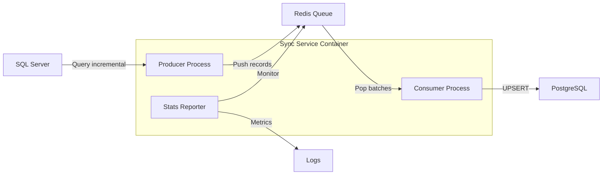

# Sync Service

**Real-time data synchronization from SQL Server to PostgreSQL using Redis as message queue**

[](https://github.com/your-username/sync-service)
[](https://python.org)
[](https://docker.com)
[](LICENSE)

## 📋 Overview

Sync Service is a high-performance, real-time data synchronization system that transfers data from SQL Server to PostgreSQL using Redis as an intermediate message queue. Built with a Producer-Consumer architecture for maximum reliability and scalability.

### 🎯 Key Features

- **Real-time sync** - Incremental updates with sub-minute latency
- **Producer-Consumer architecture** - Decoupled, scalable design
- **Redis message queue** - Reliable data transfer with persistence
- **Batch processing** - Optimized for high throughput
- **Docker-native** - Container-ready with multi-service orchestration
- **Comprehensive metrics** - Built-in monitoring and statistics
- **Graceful shutdown** - Clean process termination with signal handling
- **Error resilience** - Automatic retry and error recovery

## 🏗️ Architecture



### Data Flow

1. **Producer** queries SQL Server for incremental changes every 60 seconds
2. **Redis Queue** stores records as JSON messages with persistence
3. **Consumer** processes records in batches of 50 with UPSERT operations
4. **Stats Reporter** provides real-time metrics every 5 minutes

## 🚀 Quick Start

### Prerequisites

- Docker & Docker Compose
- PostgreSQL container (running)
- Redis container (running)
- Access to SQL Server with read permissions

### Installation

1. **Clone the repository**
   ```bash
   git clone https://github.com/your-username/sync-service.git
   
   cd sync-service
   ```

2. **Configure environment variables**
   ```bash
   cp .env.example .env
   ```

3. **Create external volumes**
   ```bash
   docker volume create sync_logs
   ```

4. **Deploy the service**
   ```bash
   docker compose up -d --build
   ```

5. **Monitor logs**
   ```bash
   docker compose logs -f
   ```

## ⚙️ Configuration

### Environment Variables

Create a `.env` file in the project root:

```bash
# SQL Server (Source)
MSSQL_HOST=your_sql_server_host
MSSQL_PORT=1433
MSSQL_DATABASE=source_database
MSSQL_USER=readonly_user
MSSQL_PASSWORD=your_secure_password
MSSQL_VIEW=source_view_name

# PostgreSQL (Target)
PG_HOST=postgres_container_name
PG_PORT=5432
PG_DATABASE=target_database
PG_USER=postgres_user
PG_PASSWORD=your_secure_password
PG_TABLE_VISTA=sync_target_table

# Redis (Message Queue)
REDIS_HOST=redis_container_name
REDIS_PORT=6379
REDIS_PASSWORD=your_redis_password
REDIS_DB=0

# Sync Settings
SYNC_INTERVAL=60        # Producer frequency (seconds)
BATCH_SIZE=50          # Consumer batch size
STATS_INTERVAL=300     # Statistics reporting interval (seconds)
```

### Database Setup

**PostgreSQL Target Table:**
```sql
-- Example target table structure
CREATE TABLE sync_target_table (
    primary_key VARCHAR(50) PRIMARY KEY,
    date_field DATE,
    boolean_field BOOLEAN,
    text_field VARCHAR(100),
    code_field VARCHAR(20),
    description_field VARCHAR(200),
    last_modified TIMESTAMP,
    created_at TIMESTAMP DEFAULT CURRENT_TIMESTAMP,
    updated_at TIMESTAMP DEFAULT CURRENT_TIMESTAMP
);

-- Automatic timestamp trigger
CREATE OR REPLACE FUNCTION update_timestamp_column()
RETURNS TRIGGER AS $$
BEGIN
    NEW.updated_at = CURRENT_TIMESTAMP;
    RETURN NEW;
END;
$$ language 'plpgsql';

CREATE TRIGGER update_target_table_timestamp
    BEFORE UPDATE ON sync_target_table
    FOR EACH ROW EXECUTE FUNCTION update_timestamp_column();

-- Index for performance
CREATE INDEX idx_target_table_last_modified ON sync_target_table(last_modified);
CREATE INDEX idx_target_table_created_at ON sync_target_table(created_at);
```

## 📁 Project Structure

```
sync-service/
├── sync_script.py
├── requirements.txt
├── Dockerfile
├── docker-compose.yml
├── .env
├── .dockerignore
└── README.md
```

## 📊 Monitoring & Metrics

### Built-in Statistics

The service provides comprehensive metrics every 5 minutes:

```
[STATS] Uptime: 2h15m | Processed: 1,247 | Queue: 0 | Rate: 12.3/sec | Errors: 0
```

### Log Files

- **Container logs**: `docker compose logs -f sync-service`
- **Persistent logs**: Stored in `sync_logs` volume at `/app/logs/sync.log`

### Key Metrics

- **Uptime** - Service runtime
- **Records processed** - Total synchronized records
- **Queue size** - Current Redis queue length
- **Processing rate** - Records per second
- **Error count** - Total errors across all processes

## 🚨 Troubleshooting

### Common Issues

**Connection refused to PostgreSQL/Redis:**
- Verify containers are running: `docker ps`
- Check network connectivity: `docker network ls`
- Ensure `.env` hostnames match container names

**SQL Server connection timeout:**
- Verify SQL Server is accessible from Docker network
- Check firewall rules and SQL Server configuration
- Validate credentials and permissions

**High memory usage:**
- Reduce `BATCH_SIZE` in `.env`
- Monitor Redis memory usage
- Check for stuck processes

**Queue growing indefinitely:**
- Monitor Consumer process logs
- Check PostgreSQL connection and performance
- Verify target table schema matches source

### Debug Mode

Enable detailed logging by connecting to the container:

```bash
docker exec -it sync-service sh
tail -f /app/logs/sync.log
```

## 🔒 Security

- **No-new-privileges**: Container runs with security restrictions
- **Read-only access**: SQL Server user has minimal permissions
- **Password protection**: All databases use authentication
- **Network isolation**: Services communicate via dedicated Docker network

## 📈 Performance

### Optimization Tips

- **Batch size**: Adjust `BATCH_SIZE` based on record size and network latency
- **Sync interval**: Lower `SYNC_INTERVAL` for near-real-time sync
- **PostgreSQL**: Use connection pooling for high-throughput scenarios
- **Redis**: Configure persistence based on reliability requirements

### Capacity Planning

- **Memory**: ~50MB base + (batch_size × record_size)
- **CPU**: Low usage, I/O bound operations
- **Network**: Dependent on data volume and sync frequency
- **Storage**: Minimal, logs are the primary consumer

## 🤝 Contributing

1. Fork the repository
2. Create a feature branch (`git checkout -b feature/amazing-feature`)
3. Commit your changes (`git commit -m 'Add amazing feature'`)
4. Push to the branch (`git push origin feature/amazing-feature`)
5. Open a Pull Request

### Development Setup

```bash
# Local development (without Docker)
pip install -r requirements.txt
python sync_script.py

# Run tests
python -m pytest tests/

# Code formatting
black sync_script.py
flake8 sync_script.py
```

## 📝 Changelog

### v1.3 - Docker Optimized (2025-07-30)
- Removed local development code
- Optimized for Docker deployment
- English comments and documentation
- Improved error handling

### v1.2 - Producer-Consumer (2025-07-27)
- Implemented Producer-Consumer architecture
- Added Redis message queue
- Comprehensive metrics system
- Graceful shutdown handling

### v1.1 - Initial Release (2025-07-15)
- Basic SQL Server to PostgreSQL sync
- Environment variable configuration
- Docker containerization

## 📄 License

This project is licensed under the MIT License - see the [LICENSE](LICENSE) file for details.

## 🙏 Acknowledgments

- Built for data synchronization needs
- Inspired by modern microservices architecture patterns
- Thanks to the open-source community for excellent Python libraries