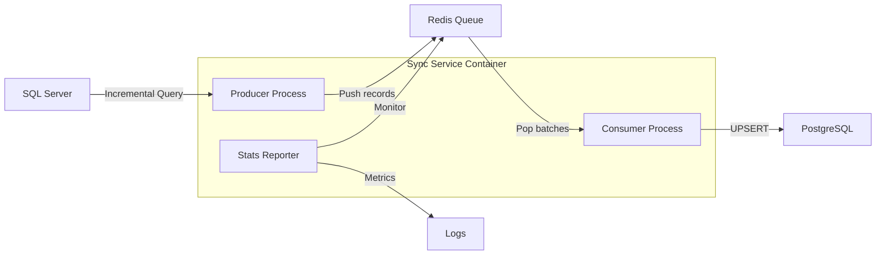

# Sync Service - Developer Documentation

## Architecture

### System Overview


### Data Flow
Producer-consumer model with Redis queue for reliability.

**Producer Process:** Queries SQL Server for incremental changes based on `ULTIMA_MODIFICACION` timestamp and pushes records to Redis queue.

**Consumer Process:** Pops batches from Redis queue and performs UPSERT operations in PostgreSQL.

**Stats Reporter:** Monitors system metrics and logs performance data.

| Component | Responsibility | Error Handling |
|-----------|---------------|----------------|
| Producer | SQL Server monitoring | Retry with exponential backoff |
| Consumer | PostgreSQL batch processing | Transaction rollback + requeue |
| Redis Queue | Message persistence | Automatic failover + persistence |
| Reporter | System monitoring | Graceful degradation |

## Project Structure

### Repository Layout
```
sync-service/
├── README.md                    # User documentation
├── docker-compose.yml           # Production deployment
├── .env.example                 # Configuration template
├── dev/                         # Development files
│   ├── README.md                # This documentation
│   ├── Dockerfile               # Container build definition
│   ├── docker-compose.dev.yml   # Development deployment
│   ├── sync_script.py           # Main application code
│   ├── requirements.txt         # Python dependencies
│   └── tests/                   # Unit tests
└── .github/
    └── workflows/
        └── docker-build.yml     # CI/CD pipeline
```

### Code Organization
Main file `sync_script.py` organized with configuration constants, metrics classes, and core process functions.

## Development Setup

### Prerequisites
- Python 3.12+
- Docker & Docker Compose
- Access to SQL Server, PostgreSQL, and Redis instances
- Git

### Local Development Environment

**Option 1: Native Python Development**
```bash
# Clone the repository
git clone https://github.com/Bl4ck0z/sync-service.git
cd sync-service/dev

# Install dependencies
pip install -r requirements.txt

# Configure environment variables
cp ../.env.example .env
nano .env

# Run the application
python sync_script.py
```

**Option 2: Docker Development**
```bash
# Clone the repository
git clone https://github.com/Bl4ck0z/sync-service.git
cd sync-service

# Configure environment variables
cp .env.example .env
nano .env

# Build and run the development container
docker compose -f dev/docker-compose.dev.yml up -d --build

# View logs
docker compose -f dev/docker-compose.dev.yml logs -f
```

### Dependencies
Core Python libraries:
- `pymssql`: SQL Server connectivity
- `psycopg2-binary`: PostgreSQL connectivity  
- `redis`: Redis client
- `python-dateutil`: Datetime parsing

## Database Setup

### SQL Server Source Requirements
Source view must include `ULTIMA_MODIFICACION` timestamp column for incremental sync. Index recommended.

```sql
CREATE VIEW your_source_view AS
SELECT 
    primary_key_field,
    data_field_1,
    ULTIMA_MODIFICACION
FROM your_source_tables;
```

### PostgreSQL Target Setup
Target table structure should match source view. Index on `ultima_modificacion` and auto-update trigger recommended.

```sql
CREATE TABLE your_target_table (
    primary_key_field VARCHAR(50) PRIMARY KEY,
    data_field_1 VARCHAR(100),
    ultima_modificacion TIMESTAMP,
    updated_at TIMESTAMP DEFAULT CURRENT_TIMESTAMP
);
```

## Performance & Optimization

### Optimization Guidelines
- **Sync Interval (`SYNC_INTERVAL`)**: Lower for real-time, higher for batch processing
- **Batch Size (`BATCH_SIZE`)**: Increase for small records/fast network, decrease for large records/slow network
- **Database Indexes**: Ensure `ULTIMA_MODIFICACION` columns are indexed

### Monitoring
Built-in metrics track producer, consumer, and system performance.

**Common monitoring queries:**
```sql
-- PostgreSQL: sync status
SELECT COUNT(*) AS total_records, MAX(ultima_modificacion) AS last_source_update
FROM your_target_table;

-- Redis: queue status
LLEN sync_queue                  -- Queue length
GET last_sync_timestamp          -- Last synced timestamp
```

## CI/CD Pipeline

GitHub Actions workflow (`docker-build.yml`):
- Builds multi-platform images (amd64, arm64)
- Publishes to GitHub Container Registry (`ghcr.io/bl4ck0z/sync-service`)
- Auto-tags with versions (`v1.3`) and `latest`

### Release Process
Update `VERSION` in `sync_script.py`, commit, and create Git tag:
```bash
git tag v1.4
git push origin main --tags
```

## Security Considerations

- **Container Security**: Non-root user execution
- **Database Security**: Minimal permissions (read-only for SQL Server, limited write for PostgreSQL)
- **Credentials**: Environment variables only, `.env` excluded from version control

## Debugging

### Common Development Issues
- **Connection failures**: Verify network connectivity and credentials
- **Container issues**: Use `docker compose logs` and `docker exec` for inspection

### Performance Debugging
- **Slow performance**: Check database indexes, Redis queue length (`LLEN sync_queue`), database locks
- **Memory issues**: Monitor with `docker stats`, consider reducing `BATCH_SIZE`

---
*For user documentation, see main [README.md](../README.md)*